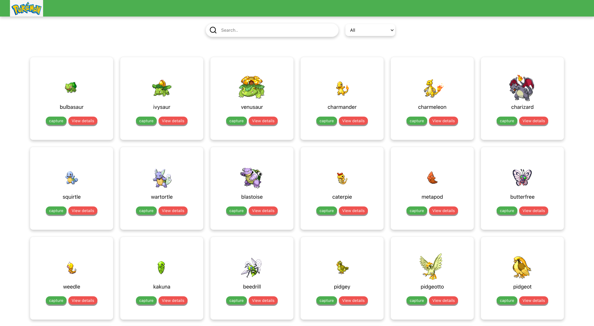
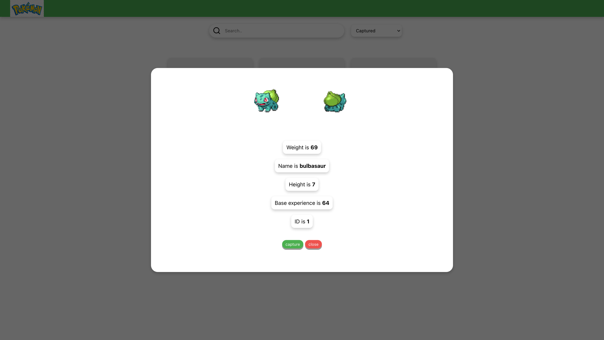
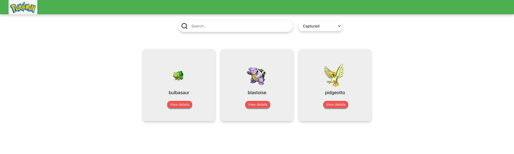

# `About`

> Minimal version of the Pokédex. API used from https://pokeapi.co/

## `Step to run the project`

- clone the repo
- $ yarn
- $ yarn start

## `Feature's`

- list of all pokemon.
- view partial of selected pokemon on click of view details.
- Captured pokemon's from the list.
- filter pokemon's from
  - All pokemon.
  - captured pokemon.
  - Not captured pokemon.
- input search bar from the filtered or default pokemon list.

## `Improvement`

- Separation of components
- TDD (automatic test cases)
- Semantic HTML

## `demo of homepage list.`

## `demo View all details of single Modal.`

## `demo of captured pokemon with filtered view.`

